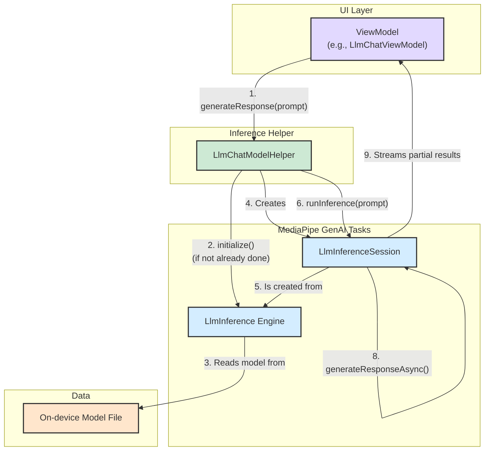

# On-Device LLM Inference Architecture

This document outlines how LLM inference is performed on the device in this project.

The project leverages the **MediaPipe Tasks GenAI** library to run large language models locally. The core logic for handling the inference process is centralized in the `LlmChatModelHelper.kt` file.

Here is a step-by-step explanation of the process:

### 1. Initialization

1.  **Configuration**: When a model is selected, the `LlmChatModelHelper.initialize()` function is called. It reads configuration parameters such as `maxTokens`, `topK`, `topP`, `temperature`, and the hardware `accelerator` (CPU or GPU) from the model's settings.
2.  **Inference Engine Creation**: It creates an instance of `LlmInference`, which is the main inference engine from the MediaPipe library. This is configured with the on-device model file path and the chosen accelerator.
3.  **Inference Session Creation**: From the `LlmInference` engine, an `LlmInferenceSession` is created. The session is configured with parameters that control the generation process, such as `topK`, `topP`, and `temperature`. This session maintains the state of the conversation.
4.  **Instance Caching**: The created engine and session are wrapped in an `LlmModelInstance` data class and stored in the `Model` object for later use.

### 2. Running Inference

1.  **Trigger**: The inference process is initiated from a ViewModel (e.g., `LlmChatViewModel` or `LlmSingleTurnViewModel`) when the user sends a message. The ViewModel calls `LlmChatModelHelper.runInference()`.
2.  **Input Processing**: The `runInference` function takes the user's text prompt, along with any images or audio clips. It adds the text, images, and audio to the `LlmInferenceSession`.
3.  **Asynchronous Generation**: The function then calls `session.generateResponseAsync()`, passing a `ResultListener` callback. This starts the inference on a background thread, allowing the UI to remain responsive.

### 3. Handling Results

1.  **Streaming Response**: The `LlmInference` engine streams the generated response back through the `ResultListener`. This listener is called multiple times with partial text results as the model generates them.
2.  **UI Update**: The ViewModel receives these partial results and updates the UI incrementally, which is what creates the "typing" effect for the chatbot's response.
3.  **Completion**: When the model has finished generating its full response, the `ResultListener` is called a final time with a `done` flag set to `true`. The ViewModel then finalizes the message and updates performance benchmarks like latency and tokens per second.

### 4. Cleanup

The `LlmChatModelHelper.cleanUp()` function is called when the model is no longer needed. It closes the `LlmInferenceSession` and the `LlmInference` engine to release the memory and other resources they were using.

### Visualization

Here is a diagram illustrating the entire flow from the user interface to the MediaPipe inference engine:

